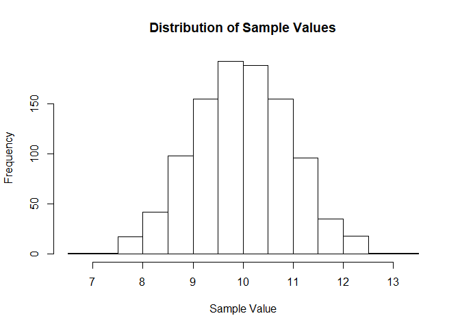
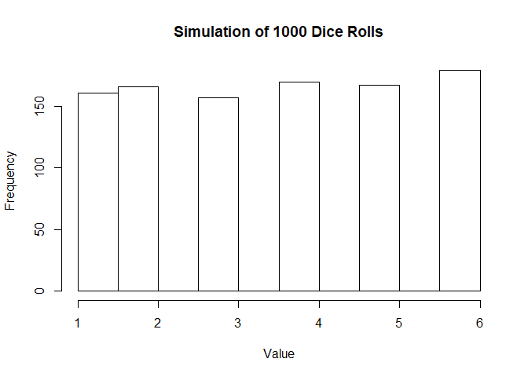
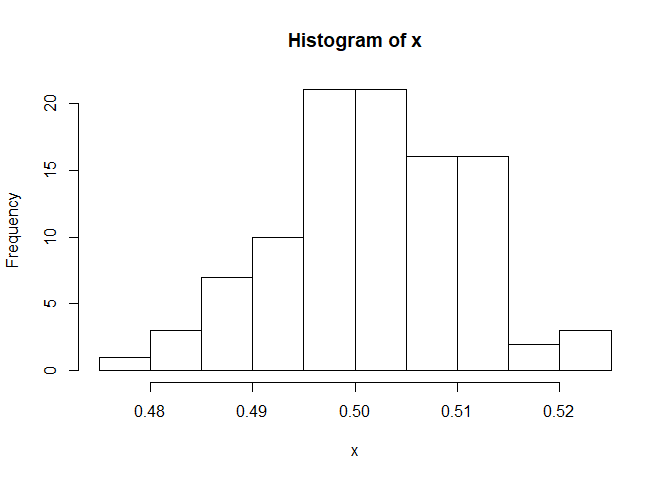
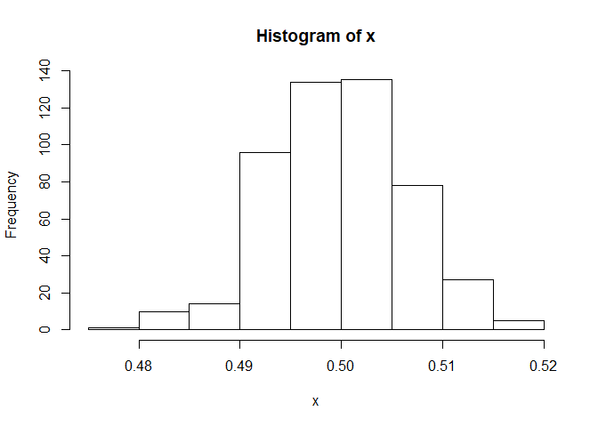
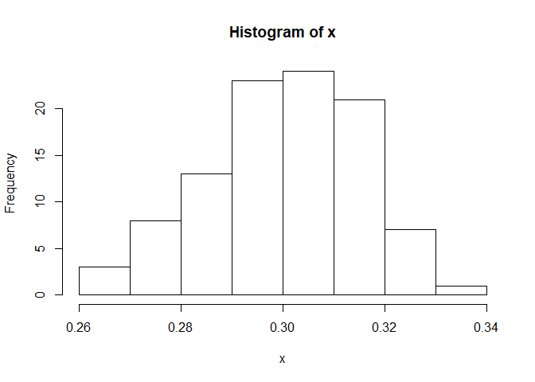
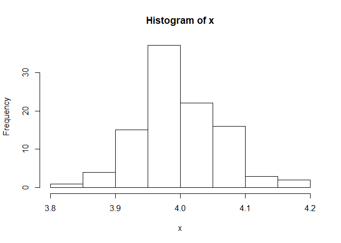

Assignment 1
================
McKenzie Kozma
9/9/2019

``` r
library(tidyverse)
```

    ## -- Attaching packages ---------------------------------------------------------------------------------------- tidyverse 1.2.1 --

    ## v ggplot2 3.2.1     v purrr   0.3.2
    ## v tibble  2.1.3     v dplyr   0.8.3
    ## v tidyr   0.8.3     v stringr 1.4.0
    ## v readr   1.3.1     v forcats 0.4.0

    ## -- Conflicts ------------------------------------------------------------------------------------------- tidyverse_conflicts() --
    ## x dplyr::filter() masks stats::filter()
    ## x dplyr::lag()    masks stats::lag()

1.  Calculate the following sums.

<!-- end list -->

``` r
x <- c(1:2019)
y <- c(1, -1)
z <- x*y

S1 = print(sum(x))
```

    ## [1] 2039190

``` r
S2 = print(sum(x^3))
```

    ## [1] 4.158296e+12

``` r
S3 = print(sum(x^x))
```

    ## [1] Inf

``` r
S4 = print(sum(z^x))
```

    ## [1] Inf

``` r
S5 = print(sum(1/(x^2)))
```

    ## [1] 1.644439

``` r
S6 = print(sum(1/x))
```

    ## [1] 8.187821

``` r
S7 = print(sum(1/(x^3)))
```

    ## [1] 1.202057

``` r
S8 = print(sum(1/z))
```

    ## [1] 0.6933948

2.  The rnorm function generate random variables from normal
    distribution. Generate a sample of 1000 values from normal
    distribution with the mean 10 and standard deviation 1.

<!-- end list -->

``` r
a <- rnorm(1000, 10, 1)
```

1.  Calculate the mean and standard deviation of the sample.

<!-- end list -->

``` r
mean(a)
```

    ## [1] 9.984642

``` r
sd(a)
```

    ## [1] 0.9644493

2.  Out of 1000 samples, how many do you think are that great than 10?
    Check your estimation.

<!-- end list -->

``` r
# I think that about 500 will be greater than 10. 
sum(a > 10)
```

    ## [1] 494

3.  Use hist() function to show the histogram of the sample.

<!-- end list -->

``` r
hist(a, xlab = "Sample Value", main = "Distribution of Sample Values")
```

<!-- -->

4.  Estimate P(X \> 1), where X N(2, 1)

<!-- end list -->

``` r
b <- c(rnorm(10000, 2, 1))
sum(b > 1)/10000
```

    ## [1] 0.8485

3.  Consider an experiment of tossing a fair dice.

<!-- end list -->

1.  Use the sample (with replacement) function to generate a sample of
    1000 values from the experiment.

<!-- end list -->

``` r
x <- sample(c(1:6), 1000, replace = TRUE)
```

2.  Calculate the mean and standard deviation of the sample.

<!-- end list -->

``` r
mean(x)
```

    ## [1] 3.553

``` r
sd(x)
```

    ## [1] 1.719345

3.  How many times the 6 occured?

<!-- end list -->

``` r
sum(x == 6)
```

    ## [1] 179

4.  Use table function to show the frequency of the values.

<!-- end list -->

``` r
table(x)
```

    ## x
    ##   1   2   3   4   5   6 
    ## 161 166 157 170 167 179

5.  Use prop.table(table()) to show the relative frequency of the
    values.

<!-- end list -->

``` r
prop.table(table(x))
```

    ## x
    ##     1     2     3     4     5     6 
    ## 0.161 0.166 0.157 0.170 0.167 0.179

6.  Plot the frequency of the values.

<!-- end list -->

``` r
hist(x, xlab = "Value", main = "Simulation of 1000 Dice Rolls")
```

<!-- -->

4.  Consider an experiment of tossing a dice 3 times. Let X1, X2, and X3
    be the number of tossing the first time, second time and third time,
    respectively. Use simulation to estimate the following
    probabilities:

<!-- end list -->

``` r
X1 <- sample(c(1:6), 1000, replace = TRUE)
X2 <- sample(c(1:6), 1000, replace = TRUE)
X3 <- sample(c(1:6), 1000, replace = TRUE)

sum(X1 > (X2 + X3)) / 1000
```

    ## [1] 0.081

``` r
sum(X1^2 > (X2^2 + X3^2)) / 1000
```

    ## [1] 0.233

5.  Using simulation, estimate the probability of getting three tails in
    a row when tossing a coin 3 times. Hint: one way is to generate a
    matrix with three columns where each rows is an observation of
    tossing a coin three times.

<!-- end list -->

``` r
x <- matrix(sample(c(0, 1), 3000, replace = TRUE), ncol = 3)

sums <- x[,1] + x[,2] + x[,3]

sum(sums == 3)/1000
```

    ## [1] 0.134

6.  (Extra Credits/Optional) Using simulation, estimate the probability
    of getting three tails in a row when tossing a coin 10 times.

<!-- end list -->

``` r
x <- matrix(sample(c("H", "T"), 10000, replace = TRUE), ncol = 10)

consec = function(x, val = "T"){
  with(rle(x), max(lengths[values == val])) 
}

counts <- apply(x, MARGIN = 1, consec)

sum(counts >= 3) / 1000
```

    ## [1] 0.518

7.  Central Limit Theorem (CLT). The CLT said that the mean of a sample
    of a distribution A (no matter what A is) follows normal
    distribution with the same mean as A. Following the below steps to
    confim the CLT when A is uniform distribution.

• Generate 100 samples of uniform distibution from 0 to 1. Each sample
has 1000 observations. Use the runif function to do this.

``` r
CLTmatrix <- matrix(runif(100000), ncol = 1000)
```

• Compute the means of the 100 samples. Create vector x containing these
means. Hint: You want to put all the samples in a matrix and use rowSums
or colSums function.

``` r
x <- rowMeans(CLTmatrix)
```

• By CLT, x must follow normal distribution. Check this by plotting the
histogram of x. Does it look like normal distribution? Use hist(x) to
plot the histogram of x.

``` r
hist(x)
```

<!-- -->

``` r
#It appears that X follows a normal distribution. 
```

• Increase the number (100 and 1000) to see if the distribution of x
looks more like normal distribution.

``` r
CLTmatrix2 <- matrix(runif(1000000), ncol = 2000)
x <- rowMeans(CLTmatrix2)
hist(x)
```

<!-- -->

``` r
#After increasing both the number of samples and the number of observations in each sample, the means appear to follow a stronger normal distribution. 
```

• Try the same procedure with two other distributions for A.

``` r
CLTmatrix.binom <- matrix(rbinom(100000, 1, 0.3), ncol = 1000)
x <- rowMeans(CLTmatrix.binom)
hist(x)
```

<!-- -->

``` r
CLTmatrix.pois <- matrix(rpois(100000, 4), ncol = 1000)
x <- rowMeans(CLTmatrix.pois)
hist(x)
```

<!-- -->

7.  Use read.csv function to read in the titanic dataset. You can find
    the dataset on Blackboard or at Kaggle.com. Use str function to see
    a summary of the data.

<!-- end list -->

``` r
titanic.data <- read.csv("titanic.csv")
str(titanic.data)
```

    ## 'data.frame':    891 obs. of  12 variables:
    ##  $ PassengerId: int  1 2 3 4 5 6 7 8 9 10 ...
    ##  $ Survived   : int  0 1 1 1 0 0 0 0 1 1 ...
    ##  $ Pclass     : int  3 1 3 1 3 3 1 3 3 2 ...
    ##  $ Name       : Factor w/ 891 levels "Abbing, Mr. Anthony",..: 109 191 358 277 16 559 520 629 417 581 ...
    ##  $ Sex        : Factor w/ 2 levels "female","male": 2 1 1 1 2 2 2 2 1 1 ...
    ##  $ Age        : num  22 38 26 35 35 NA 54 2 27 14 ...
    ##  $ SibSp      : int  1 1 0 1 0 0 0 3 0 1 ...
    ##  $ Parch      : int  0 0 0 0 0 0 0 1 2 0 ...
    ##  $ Ticket     : Factor w/ 681 levels "110152","110413",..: 524 597 670 50 473 276 86 396 345 133 ...
    ##  $ Fare       : num  7.25 71.28 7.92 53.1 8.05 ...
    ##  $ Cabin      : Factor w/ 148 levels "","A10","A14",..: 1 83 1 57 1 1 131 1 1 1 ...
    ##  $ Embarked   : Factor w/ 4 levels "","C","Q","S": 4 2 4 4 4 3 4 4 4 2 ...

8.  Use knitr::kable function to nicely print out the first 10 rows of
    the data in
markdown.

<!-- end list -->

``` r
knitr::kable(titanic.data[1:10,])
```

| PassengerId | Survived | Pclass | Name                                                | Sex    | Age | SibSp | Parch | Ticket           |    Fare | Cabin | Embarked |
| ----------: | -------: | -----: | :-------------------------------------------------- | :----- | --: | ----: | ----: | :--------------- | ------: | :---- | :------- |
|           1 |        0 |      3 | Braund, Mr. Owen Harris                             | male   |  22 |     1 |     0 | A/5 21171        |  7.2500 |       | S        |
|           2 |        1 |      1 | Cumings, Mrs. John Bradley (Florence Briggs Thayer) | female |  38 |     1 |     0 | PC 17599         | 71.2833 | C85   | C        |
|           3 |        1 |      3 | Heikkinen, Miss. Laina                              | female |  26 |     0 |     0 | STON/O2. 3101282 |  7.9250 |       | S        |
|           4 |        1 |      1 | Futrelle, Mrs. Jacques Heath (Lily May Peel)        | female |  35 |     1 |     0 | 113803           | 53.1000 | C123  | S        |
|           5 |        0 |      3 | Allen, Mr. William Henry                            | male   |  35 |     0 |     0 | 373450           |  8.0500 |       | S        |
|           6 |        0 |      3 | Moran, Mr. James                                    | male   |  NA |     0 |     0 | 330877           |  8.4583 |       | Q        |
|           7 |        0 |      1 | McCarthy, Mr. Timothy J                             | male   |  54 |     0 |     0 | 17463            | 51.8625 | E46   | S        |
|           8 |        0 |      3 | Palsson, Master. Gosta Leonard                      | male   |   2 |     3 |     1 | 349909           | 21.0750 |       | S        |
|           9 |        1 |      3 | Johnson, Mrs. Oscar W (Elisabeth Vilhelmina Berg)   | female |  27 |     0 |     2 | 347742           | 11.1333 |       | S        |
|          10 |        1 |      2 | Nasser, Mrs. Nicholas (Adele Achem)                 | female |  14 |     1 |     0 | 237736           | 30.0708 |       | C        |

9.  Use is.na function and sum function to count the total number of
    missing values in the data. Count the number of missing values in
    each
    columns.

<!-- end list -->

``` r
sum(is.na(titanic.data))
```

    ## [1] 177

``` r
colSums(is.na(titanic.data))
```

    ## PassengerId    Survived      Pclass        Name         Sex         Age 
    ##           0           0           0           0           0         177 
    ##       SibSp       Parch      Ticket        Fare       Cabin    Embarked 
    ##           0           0           0           0           0           0

10. Calculate the average Age of the passengers. You may want to use the
    parameter na.rm = TRUE in the function mean

<!-- end list -->

``` r
mean.age <- mean(titanic.data$Age, na.rm = TRUE)
```

11. Replace the missing values of age by the average age calculated
    previously.

<!-- end list -->

``` r
titanic.data <- titanic.data %>% 
  mutate(Age = ifelse(is.na(Age), mean.age, Age))
```

12. Remove columns Name, PassengerID, Ticket, and Cabin.

<!-- end list -->

``` r
titanic.data <- titanic.data %>% 
  select(-Name, -PassengerId, -Ticket, -Cabin)
```

13. Calculate the mean age of female passengers

<!-- end list -->

``` r
mean(filter(titanic.data, Sex == "female")$Age, na.rm = TRUE)
```

    ## [1] 28.21673

14. Calculate the median fare of the passengers in Class 1

<!-- end list -->

``` r
median(filter(titanic.data, Pclass == 1)$Fare, na.rm = TRUE)
```

    ## [1] 60.2875

15. Calculate the median fare of the female passengers that are not in
    Class
1

<!-- end list -->

``` r
median(filter(titanic.data, Sex == "female" & Pclass != 1)$Fare, nna.rm = TRUE)
```

    ## [1] 14.45625

16. Calculate the median age of survived passengers who are female and
    Class 1 or Class
2

<!-- end list -->

``` r
median(filter(titanic.data, Survived ==1 & Sex == "female" & Pclass %in% c(1,2))$Age, na.rm = TRUE)
```

    ## [1] 30

17. Calculate the mean fare of female teenagers survived
passengers

<!-- end list -->

``` r
mean(filter(titanic.data, Sex == "female" & Survived == 1 & Age > 12 & Age < 20)$Fare, na.rm = TRUE)
```

    ## [1] 49.17966

18. Calculate the mean fare of female teenagers survived passengers for
    each class

<!-- end list -->

``` r
titanic.data %>% 
  filter(Sex == "female" & Survived == 1 & Age > 12 & Age < 20) %>% 
  group_by(Pclass) %>% 
  summarise(mean = mean(Fare))
```

    ## # A tibble: 3 x 2
    ##   Pclass   mean
    ##    <int>  <dbl>
    ## 1      1 108.  
    ## 2      2  20.0 
    ## 3      3   8.77

19. Calculate the ratio of Survived and not Survived for passengers who
    are who pays more than the average fare

<!-- end list -->

``` r
nobs <- nrow(filter(titanic.data, Fare > mean(Fare)))
survive <- sum(filter(titanic.data, Fare > mean(Fare))$Survived) 

survive/(nobs - survive)
```

    ## [1] 1.482353

20. Add column that standardizes the fare (subtract the mean and divide
    by standard deviation) and name it sfare

<!-- end list -->

``` r
titanic.data <- titanic.data %>% 
  mutate(sfare = (Fare - mean(Fare))/ sd(Fare))
```

21. Add categorical variable named cfare that takes value cheap for
    passengers paying less the average fare and takes value expensive
    for passengers paying more than the average fare.

<!-- end list -->

``` r
titanic.data <- titanic.data %>% 
  mutate(cfare = ifelse(Fare < mean(Fare), "cheap", "expensive"))
```

22. Add categorical variable named cage that takes value 0 for age 0-10,
    1 for age 10-20, 2 for age 20-30, and so on

<!-- end list -->

``` r
titanic.data <- titanic.data %>% 
  mutate(cage = trunc(Age / 10) * 10)
```

23. Show the frequency of Ports of Embarkation. It appears that there
    are two missing values in the Embarked variable. Assign the most
    frequent port to the missing ports. Hint: Use the levels function to
    modify the categories of categorical variables.

<!-- end list -->

``` r
summary(titanic.data$Embarked)
```

    ##       C   Q   S 
    ##   2 168  77 644

``` r
levels(titanic.data$Embarked) <- c("S", "C", "Q", "S")
```
